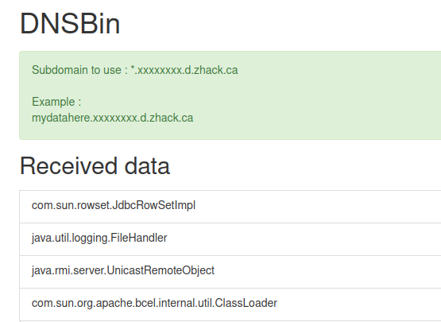

## GadgetSmith
CLI script to use [GadgetProbe](https://github.com/BishopFox/GadgetProbe) as a library to generate serialized payloads of DNS callbacks to free DNSbin to probe what Java classpaths are available.

#### Why?
* If you don't have BurpSuite pro and can't use Burp collaborator hence unable to use the Burp extension.

#### Requirements
* Install Java.
* Download GadgetProbe jar from [here](https://github.com/BishopFox/GadgetProbe/releases) and put it in same folder.

#### Usage
* Create a free DNSbin from [https://interact.projectdiscovery.io/](https://interact.projectdiscovery.io/#/) or [https://requestbin.net/dns](https://requestbin.net/dns) or [http://dnsbin.zhack.ca/](http://dnsbin.zhack.ca/)
* Modify the python skeleton script to your needs to fuzz the deserialization endpoint
* Run

```sh
python3 gadgetsmith.py wordlists/FasterXML_blacklist.list xxxxxxx.d.zhack.ca
```


